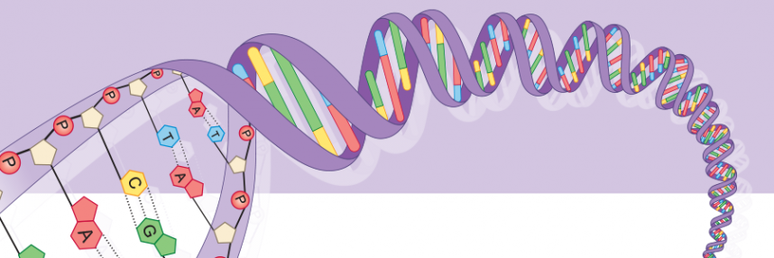
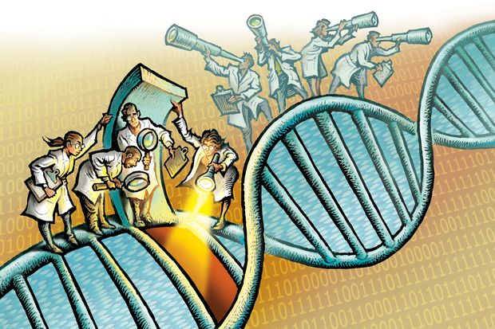

---
title:
output: 
  html_document:
    includes:
       in_header: googleAnalytics.Rhtml
---

</script>

***
</script>
 

 
 

 

# __Genetics 711/811__ 
Contact Information for Prof. Matthew MacManes: 
Office: 434 Gregg Hall 
Email: Matthew.MacManes@unh.edu  
Office hours: Monday 8-9AM in 434 Gregg, or by appt.  
Schedule at (https://my.unh.edu/task/durham/mywildcat-success) 
 
Contact Information for TA Dani Blumstein: 
Office: 430 Gregg Hall 
Email: dmb1086@wildcats.unh.edu  
Office hours: Wednesday 11-12AM in 430 Gregg, or by appt.

- [Class Zoom link](https://unh.zoom.us/j/91624774331?pwd=MGhFS3Y3YzRrVmxRSVZ1NzJDd2l5UT09)
 
- [Class slack channel](https://gen711s21.slack.com/join/invite/enQtMTY3ODMwNDM3ODE5NC0xZGQ1NTEwYzZkZWY5MzgwYTMzMWI0ZDkxNWIzODkwM2QwYzQ0NzYwYTUwMzk2YTBjMjQzMTgzYzE5Mjc0NGUz#/credentials) Email Dani if link doesn't work  
- [Syllabus](Gen711_2021_syllabus.pdf)

 
MWF 10:10-11:00PM Gregg 110 
Monday class will be in person for those who want this. 
 
Friday 3:10-5:00PM Kingsbury N134
Will be in person for 11 people (which 11, TBD) 

