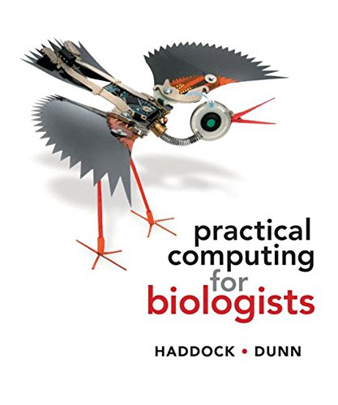

</script>

 

***

### __1. COURSE DESCRIPTION:__
The methods, applications, and implications of genomics–the analysis of whole genomes. Microbial, plant
and animal genomics are addressed, as well asmedical, ethical and legal implications. The lab provides exposure
and experience on a range of bioinformatics approaches–the computer applications used in genome
analysis. Much of this course content was written by Professor Matthew MacManes 

### __2. CONTACT INFORMATION:__
Instructor: Jeffrey Miller 
Email: jeffrey.miller@unh.edu 
Office: Rudman 312 
Office hours: 8:30-10:30am or by appointment 

TA: Haley Nolen, PhD Candidate 
Email: Haley.Nolen@unh.edu@wildcats.unh.edu 
Office: Rudman 312
Office hours:  

### __3. ZOOM LINK:__
Check the canvas zoom link

### __4. LECTURE:__
MWF 10:10-11:00PM NESM 140 

### __5. LAB:__
Friday 3:10-5:00PM in HORT 207 

### __6. COVID19:__
Without a doubt, learning and teaching during global pandemic is going to come with significant
challenges! What I want you all to know at the very beginning is that I amright there with you, trying
to figure out what it means to live and regain some normalcy in these exceptionally strange
times, while still being safe. I hope we can all figure this out ASAP. 

In terms of classroom instruction, it is very likely that we operate using some hybrid model for the
entire semester. If conditions permit to continue in-person instruction, I will be the strongest
advocate for that! I would like nothing more than to be in-person with you all. 

Full disclosure, I’m not an expert in online class delivery, so I do expect some challenges. These
are likely to be small but annoying (like internet, video, audio issues). What I want from you, is
your commitment to tell me what I can do better or different in real time. I promise to not be
offended if you tell me something I’m doing is not working for you! We’re all figuring this out
together in very real sense, so open communication will be critical! 

There are very likely to be changes to the class because of COVID, including some that are unanticipated.
For instance, how will I administer exams. The university has invested in a remote
proctoring system, but no one is quite sure how well this will work. What this means is that we
will have to make decisions and changes as we go along. I run the class more like a democracy
than dictatorship, so we will vote on issues whenever possible. Please be flexible with me, and I
promise I will be flexible with you all. 

### __7. WEB RESOURCES:__
Canvas: I will use this for grades 
Website: https://jthmiller.github.io/GEN711_S21/ 
Google: All of the computational tools you'll learn this semester has been discussed by the world-wide bioinformatics community. A huge part of applied bioinformatics it is just a matter of learning how to ask the question in way that someone else has. stackoverflow.com is where it's at!  
SummerWorkshops: https://angus.readthedocs.io/en/2019/ 

### __8. ASSIGNMENTS AND EXAMS:__
__Lab Assignments:__ These are assigned in lab, and typically involve some sort of sequence
analysis, short answer questions, and the notes that you took during lab. You may work in groups, but you must submit your own report. 
These will be due in lab, unless otherwise instructed. NO late assignments accepted. 
9 labs, lowest dropped. 80/200 lab and discussion points  

__Lab Practicals:__ Two lab practical exams (50 pts each, 100/200 of the lab and discussion points). 

__Paper Discussion Participation Points:__ We will discuss genomics and bioinformatics papers over the semester. 
Groups will be tasked with summarizing the paper to get discussion rolling. Participation in this discussion will earn 
20 points (20/100)

On presentation day: Each group will lead class through discussion of the chosen paper. Groups should email me their slides no later than 9am of their presentation day. 
At least 1 slide by the grad student in each group to introduce the topic, their research and larger questions addressed by the paper.
The intro should addess questions such as "What is the goal of the study and why is the study important enough to be published?"
Students should present 1-2 Methods slides (Use methods figure from paper or from web and cite it!) to answer: 'What is the experimental design?',
'Was something sequenced and how?'. 1 Results slide (at least) should be presented per figure (Interpret each), and answer: 'What was measured and/or tested?' and 'What observation/conclusion does the figure support?'
For discussion, one slide ( more as needed so that everyone has at least one slide) should address 'What did they do well? What could have been done differently? What is next?'
Each group needs to answer questions to clarify answers to the questions above. 

__Exams:__ There will be 2 exams covering both lecture and lab material. Each will be worth 100
points. The dates for these will be March 4 and April 22. Makeup exams will be permitted only
under extreme documented circumstances, or by prior approval (>1week) from the instructor. 

__Final Project:__ The final project will consist of an oral presentation and written report of a topic
related to genomics and bioinformatics. Projects must incorporate an implementation of the
computational techniques we’ve learned about. The final project will be worth 200 points (150
written/50 oral). Oral presentations will occur during the last week of class. Written reports
will be due on the last day of class. You may work in groups (<6 members - mix of grad and
undergrad), with the understanding that expectations increase with group size, given division of
labor. More details will be provided later in the semester.

### __9. MATERIALS NEEDED:__
__Non-Required but potentially useful Textbook:__ PRACTICAL COMPUTING FOR BIOLOGISTS 1st
edition by Haddock and Dunn. It is available on Amazon new, used and for rent. I think that there
is a Kindle version if that is your thing! It should also be available in the campus bookstore, but
you may pay more there! 

__AWS Account:__ The proportion of genome analyses in the cloud is increasing every day. 
Supercomputers that usually host our web searches (google) and web shopping (Amazon) sell their extra comutational power when volume is low. 
We will try to scratch the surface of this approach to analyzing genomic data at Amazon (AWS). 
Cloud-computing comes with powerful and cost-cutting tools that will be commonplace in the future of bioinformatics.  

__Jetstream:__ For lab exercises, we will use Jetstream, which is an XSEDE resource. You will need
to set up an account during the first lab. The EC2 interface will work properly in OSX and Linux
operating systems. For those of you with Windows computers, you may need to install a terminal
emulator (MobaXterm is one option), or use the OSX computers in the computer lab. 

__Laptop:__ Please no one purchase a laptop for this course!!! But please bring it to all course meetings
if you do. A Mac or Linux machine will make your life much easier. Windows machines will
work with some additional effort. 

### __10. GRADES:__
The grade scale is: 93-100=A; 90-92.99=A-; 87-89.99=B+; 83-86.99=B; 80-82.99=B-; 77-79.99=C+;
73-76.99=C; 70-72.99=C-; 67-69.99=D+; 63-66.99=D; 60-62.99=D-; Below 60=F 

| Item          |Maximum Points
|---------------|-----:|
|Exams          |200
|Final Project  |200
|Lab and Discussion  |200
|**Total Points**   |**600**

### __11. COURSE POLICIES:__
__Student conduct:__ Honesty is a core value at the University of New Hampshire. The members of
this academic community require and expect one another to conduct themselves with integrity.
The Student Rights, Rules and Responsibilities handbook (www.unh.edu/student/rights) explains
UNH’s expectation for academic honesty and defines those actions that constitute academic misconduct
with regard to exams, homework, plagiarism, computers, etc. The penalty for the first incident of cheating, plagiarism or other breaches of the university’s academic honesty policies will be an automatic F grade for that assignment. A second infraction will result in an F grade for the class. The Dean’s office will be notified and dismissal from the university could
result. 

__Disability Services for Students:__ The University of New Hampshire is committed to providing
students with documented disabilities equal access to all university programs and facilities. If
you have a disability requiring accommodation, you must register with Disability Services for
Students (DSS). Contact DSS at 862-2607. If you have received an Accommodation Letter for this
course from DSS, please meet with me privately to review those accommodations.

### __12. CODE OF CONDUCT:__ 
Need Help? You can reach the course instructor, Jeffrey Miller at Jeffrey.Miller@unh.edu.
Conversations are held in confidence, to the extent that it is allowed by UNH policy (https://www.unh.edu/sharpp/reporting-requirements) and state and federal law. 

__The Code:__ Our class is dedicated to providing a harassment-free classroom experience for everyone,
regardless of gender, age, sexual orientation, disability, physical appearance, race, or
religion (or lack thereof). I do not tolerate harassment of class participants in any form. Sexual
language and imagery is not appropriate for any class venue. Class participants violating these
rules will be reported to the COLSA Dean’s office. 

Harassment includes offensive verbal comments related to gender, age, sexual orientation, disability,
physical appearance, race, religion, sexual images in public spaces, deliberate intimidation,
stalking, following, harassing photography or recording, sustained disruption of talks or
other events, inappropriate physical contact, and unwelcome sexual attention. Class participants asked to stop any harassing behavior are expected to comply immediately. If a participant engages in harassing behavior, the instructor may take any action they deem appropriate,
including warning the offender, or reporting to the Dean’s office. If you are being harassed, notice that someone else is being harassed, or have any other concerns,
please contact me or the TA immediately. 

We will be happy to help participants contact local law enforcement, provide escorts, or otherwise
assist those experiencing harassment to feel safe for the duration of the class.
This code of conductwas adapted from http://angus.readthedocs.io/en/2019/code-of-conduct.html 

### __13. HOW TO GET AN A:__
Receiving an A in this should be really easy (I mean it!), assuming you follow these basic
guidelines. 
- Come to class and lab, pay attention, be interactive: Active learning far outcompetes passive,
so while coming to class itself is good, interacting/asking questions will be much better. 
- Ask questions when your confused. Come to office hours, or schedule a time to meet. 
- Don’t cram! Study a little, several times per week. You will remember more, and the exams
will be less stressful. 

### __14. COURSE SCHEDULE - SUBJECT TO CHANGE:__

Week   | Topic                                           | Lab
|:---------:|:-------------------------------------------------:|:---------------------------:|
Jan 26    | Intro to Bioinformatics & Next Gen Seq          | Take home lab 
Jan 31    | Sequence Data & Technology, QAQC                | Curtail Dat
Feb 7     | DNA & RNA Seq, Metadata and Genome Alignment    | Introduction to the Command Line for Genomics 1
Feb 14    | Advanced Search and alignment (BLAT/HMM/others) | Introduction to the Command Line for Genomics 2
Feb 21    | Molecular Evolution                             | Data Wrangling and Processing for Genomics 1
Feb 28    | Genome Assembly and Annotation                  | Data Wrangling and Processing for Genomics 2
          | ***March 4th EXAM 1***                          |
Mar 7     | Population Genomics                             | Practical Exam Given in Lab
Mar 14    | BREAK                                           |
Mar 21    | Community Genomics                              | Microbiome analysis 1
Mar 28    | RNA and Transcriptomics                         | Microbiome analysis 2
Apr 4     | RNA and Transcriptomics                         | Github and Cloud Computing
Apr 11    | Stats and Genomics (MDS and Linear Models)      | Data Analysis and Vis
Apr 18    | Functional Genomics                             | Final Project work session
          | ***Apr 22nd EXAM 2***                           | 
April 25  | Functional Genomics                             | Practical Exam Given in Lab
May 2     | Personal and Medical Genomics                   | Final Project work session
May 9     | Final Project Presentations                     | No Lab

 

