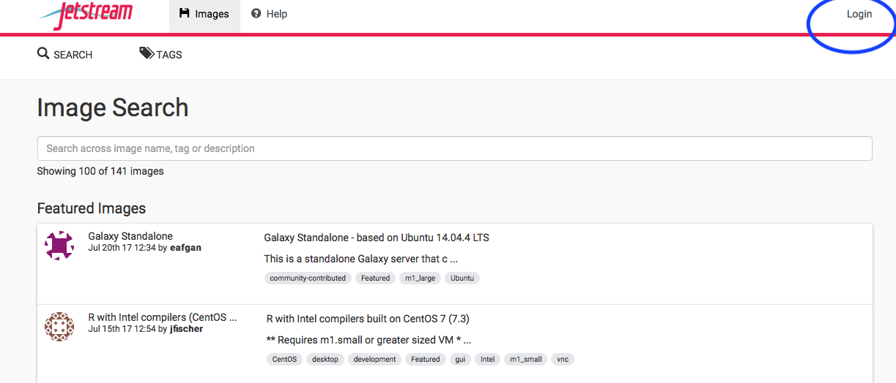
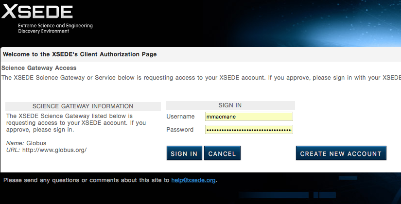
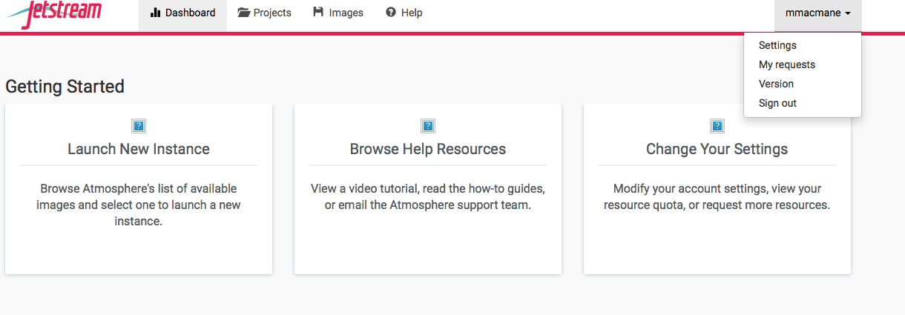
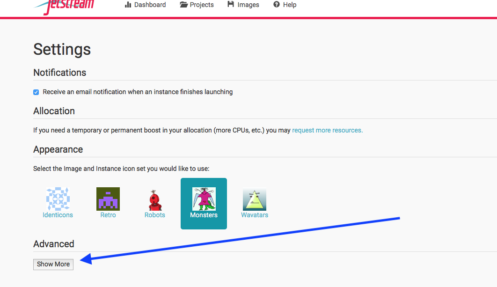
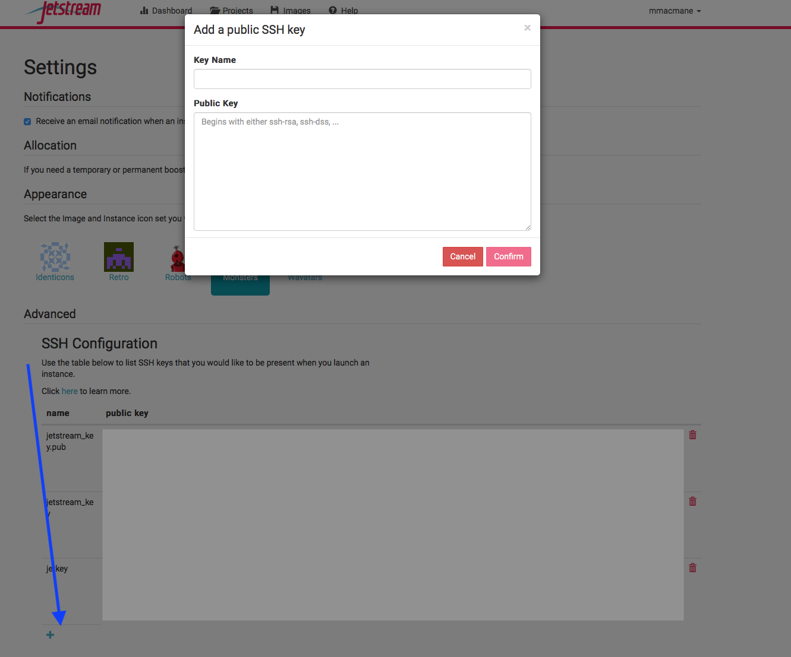

Using SSH to connect to your Jetstream instance
---

Watch 0:00 to 3:09. Then you can jump ahead to 9:20 if you don't want to sit and watch the instance deploy 

<video width=100% height="500" controls>
  <source src="pics/zoom_0.mp4" type="video/mp4">
</video>

### Before you launch an instance, go to PuTTygen

## Select generate and move your mouse over the putty window to make it load faster
## Once the key is generated you should see it in the box (highlited in blue in the picture below)
## Highlight and copy the key

## Navigate to the Jetstream page, and log in

Navigate to https://use.jetstream-cloud.org/

### Login using your XSEDE credentials

### Type your stuff in, and select "SIGN IN"

 

### To go to settings, click on your user name.

## Click "Show More"

## Click "plus sign", enter details
Name the key "jetkey", and paste in key using `command-v`. then click confirm.

### If you sit at the same computer each time, or use your personal laptop, you *should* not need to make a new key again.

## Go back to PuTTygen:

Select "save private key"  
Select "yes" in the warning box
and save it to a place you will be able to find on your computer.

## Close PuTTYgen and open PuTTY
Highlight "Default Settings"

Select "+SSH" and then "Auth"

Click "Browse..." and add the key that you saved locally on your computer

Slelect "Sessions"

Make sure "Default Settings" is highlighted by clicking on it and then press save

Add your IP address as the host name and then click open

In your terminal that just opened type only your username and press enter!
Congrats you did it!! For all future instances you will only need your IP address 
