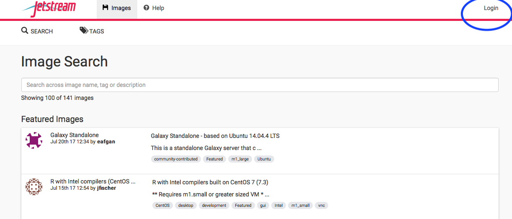
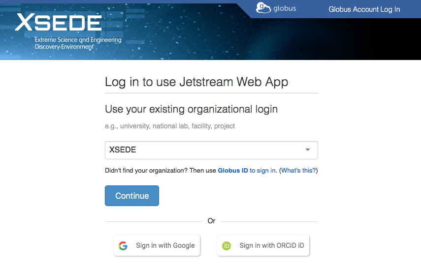
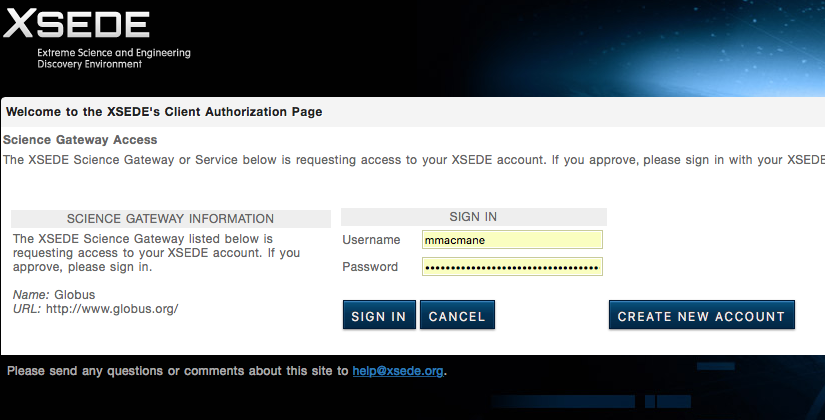
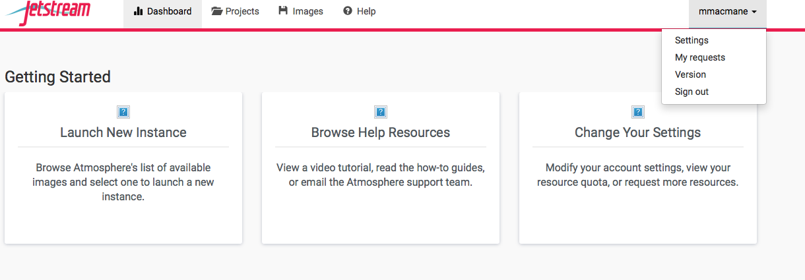
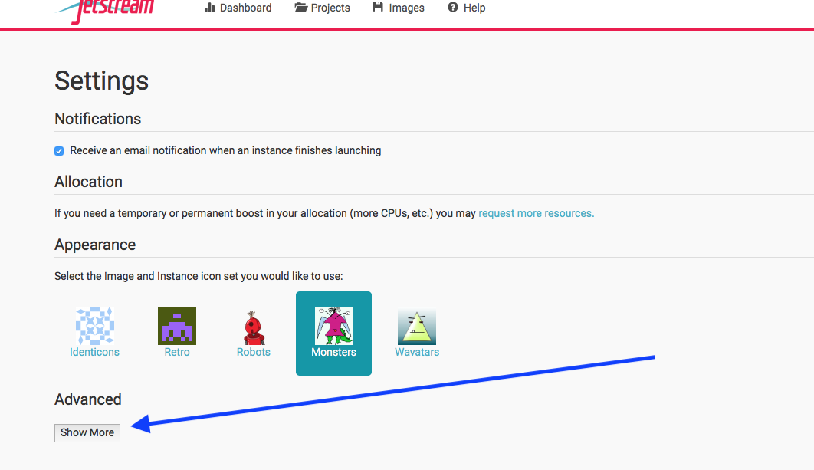
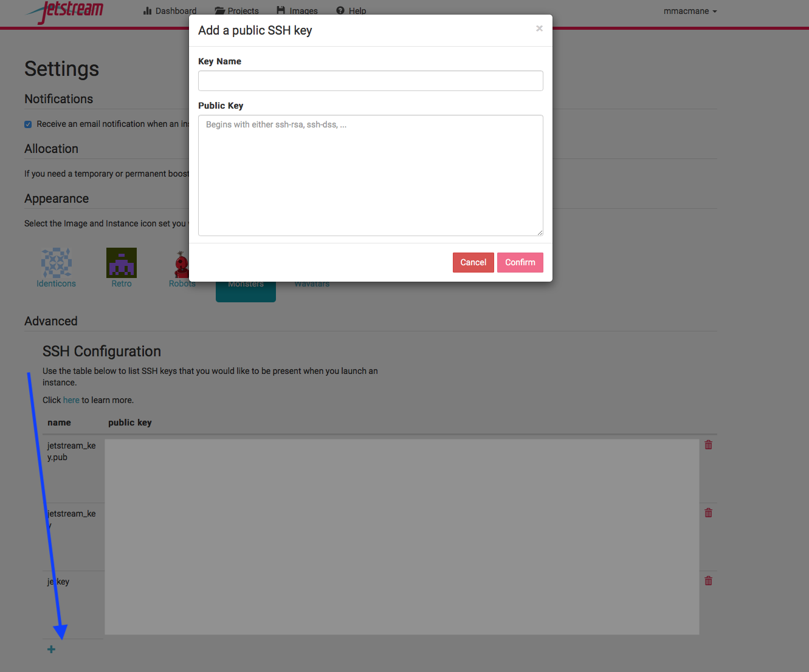

Using SSH to connect to your Jetstream instance
---


### Before you launch an instance, go to your terminal and type.

```
ssh-keygen -t rsa -f $HOME/jetkey
```

## Something will happen, and it will ask you for a password - this can be simple (like "password").
After this is done, some stuff will happen (it will look kinda like a techie picture for you, like a diagonal rabbit head).

```
more $HOME/jetkey.pub | cut -d " " -f1-2 | pbcopy
```


## Navigate to the Jetstream page, and log in

Navigate to https://use.jetstream-cloud.org/



### Login using your XSEDE credentials



### Type your stuff in, and select "SIGN IN"

 


### To go to settings, click on your user name.



## Click "Show More"



## Click "plus sign", enter details
Name the key "jetkey", and paste in key using `command-v` (I sneakily copied the key, above, using the `pbcopy` command). then click confirm.




### If you sit at the same computer each time, or use your personal laptop, you *should* not need to make a new key again.
